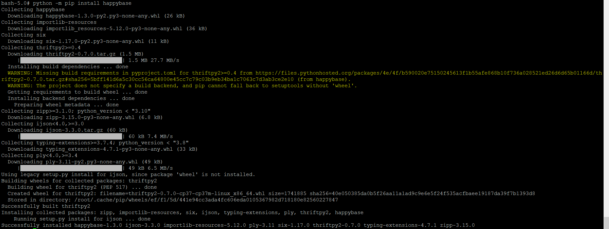
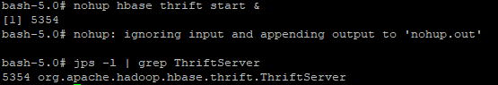

# Project Summary

## Implementation Overview

The purpose of this project is to demonstrate various big data technologies and how they work together to ingest, store, process, and analyze large datasets. 
While the dataset selected for this project is not that large (only 9 columns and 178 rows), the overall process that I applied can be extended to much larger datasets and compute clusters.

The overall pipeline is as follows:
**Source Data → NiFi → HDFS → Hive → Spark MLlib → HBase**
Starting with the source data in a github repository, I used NiFi to ingest it into HDFS.
I converted the CSV i HDFS to a Hive managed table to make the data more easily query-able and accessible to Spark.
I ran Python code in Spark to train and test a linear regression model on the data from the Hive table.
I recorded the evaluation metrics from the model in and HBase Table.

Spark execution is submitted through **YARN**.

## Dataset

**Dataset name:** Home_Temps.csv  
**GitHub direct URL:** https://raw.githubusercontent.com/zkatz100/dsc650-big-data-portfolio/refs/heads/main/sample-data/Home_Temps.csv

My house is a somewhat insulated, climate controlled, box that is isolated from the outside temperature. However, over the course of the day, the indoor temperature still does fluctuate as the outdoor temperature changes. I wondered whether this relationship between indoor and outdoor temperature can be used to predict the outdoor temperature if the indoor temperature is known.

The dataset contains one week of outdoor hourly temperatures measured at a weather station in my neighborhood, along with the indoor temperature and relative humidity measured in 3 different rooms in my house (bathroom, bedroom, and dining room measured at the same times, from the last week. All data was recorded by, and downloaded from, a Home Assistant server running in my house.

## Environment Setup

All operations for this project were run on various docker containers running on a Google Cloud virtual machine. 

In order to run properly, many python packages were needed. Some, like Spark.ml are included by default with Spark, while others such as numpy needed to be installed separately.

HBase natively uses java as its programing language. In order to communicate with it through python, I needed to install the Happybase package as well. This package uses the HBase Thrift server to communicate with HBase, so I needed to start the Thrift server before I could run the Spark python code.

### Package Installation Evidence

### HBase Thrift Server Evidence

## What Worked

In this project, I was able to successfully ingest data into HDFS using Nifi and then save that data as a Hive managed table.
I was also able to read that data through Spark, train a linear regression model using the data, and save the evaluation metrics from that model in a HBase table

## Issues & Challenges Encountered

I think the most challenging part of this project was perfecting the Spark python code to train and test the linear regression model.
I tried to run this code multiple times in Spark and it returned several different errors before it finally ran successfully. Each time I encountered an error, I checked the YARN logs for that application to find details about the error. I then changed the code and re-ran it to see if it would work.

The first error I ran into was that numpy was not installed properly on the entire cluster. I was surprised by this issue because my code did not directly call numpy so I did not think I would need it. I then realized that numpy is a dependency for Spark.ml so I installed it.

The second error I ran into was that my code was throwing an error that HappyBase was not installed, even though I knew it was. I realized that I needed to change the call to import HappyBase to after the Spark Session was already started in order to access HappyBase installed on the Spark nodes.

Finally, in my original code I had instructed HappyBase to write the model type to a column family in HBase instead of a column within that family. I learned that even if a column family only has one column in it, you still need to specify both the column and the family in order to save the table properly.

## Results

Summarize the final technical results, including the successful movement of data through the pipeline and the machine learning results produced by Spark MLlib.
In this project, I successfully ingested data into a big data pipeline, saved that data, and then used it to train a machine learning model. Unfortuanly, the metrics from that machine learning model showed that the predictions from that model about the test data were not very good.

## Lessons Learned

This project was a great overview of how the various big data technologies that we learned about in this course can be used together to process any size dataset quickly and efficiently.
I think the most important lesson I learned was to pay attention to the various prerequisites and dependencies of every tool to make all of those integrations seamless and efficent.

## Production Considerations

While the pipeline I set up in this case worked well, there are significant changes I would make if it was to be used in a production environment:

Many of the steps in this process such as running the NiFi flow to ingest the data, writing the data to Hive, running the Spark code, and evaluating the metrics saved in HBase were done manually. In a production tool I would streamline and automate these steps in order to make the tool easier for anyone to use.
Similarly, the rowkey and model_type that I wrote to HBase were both hardcoded in my python code. In a production environment I would rewrite the code to add those automatically and to have them change automatically if the model type changed.

In this case, I was running the entire Hadoop ecosystem on containers in a small Google Cloud VM, where I only saved one copy of my dataset. In a production environment I would run this system on several separate servers in order to allow me to replicate the data for fault tolerance and to store and process much larger datasets.

In a production environment I would have saved more details of each ml model, not just the evaluation metrics, so that I could choose the best model and use it to make more predictions on new data coming in.

Finally, all data I used in this project was my own that I collected in my house. In a production situation where I do not know the provenance of all of the data  I would add in additional steps to validate the data before saving it or training the model.
