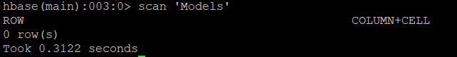
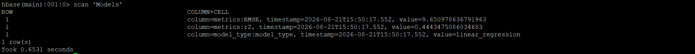

# Apache HBase — Model Metrics Persistence

## Role in the Pipeline

Apache HBase provides the NoSQL persistence layer for the machine learning metrics generated by Spark MLlib.

The HBase table is created before the Spark job runs, verified with an empty scan, populated by the PySpark application, and scanned again after execution to confirm that the model-performance metrics were successfully stored.

## Table Design

**Table name:** `Models`  
**Row key:** `For the row key we will use a counter that increases by one each time a model is trained and tested.`  
**Column family/families:** `model_type and metrics`

Because I am not actually running this program on a very large dataset on a distributed system, I felt that a simple row key that just increments by 1 each time a new model is trained would be appropriate in this case.
For column families, I created one family that just stores the type of model that is being trained and evaluated, and a second family that stores the metrics about how well that model did at predicting values.

## HBase Commands

The commands used to create and inspect the table are stored in:

[`commands.txt`](commands.txt)

## Empty Table Verification

The empty scan shows that the table was created properly, if the table was not created the, scan would return "unknown table".

## Metrics Written by Spark

The metrics Spark wrote into HBase are RMSE and r2. These two values describe how well the predictions made by the regression model compare to the actual values in the original dataset.

## Populated Table Verification

The screenshot shows that the model type (linear regression) as well as the two evaluation metrics from that model were recorded into HBase. This gives us a convenient place to store these metrics if we want to train and compare multiple models instead of needing to search through the YARN logs to find them.

This final scan provides end-to-end verification that the pipeline successfully moved from ingestion and distributed storage through SQL access, machine learning, and persistent NoSQL results.
