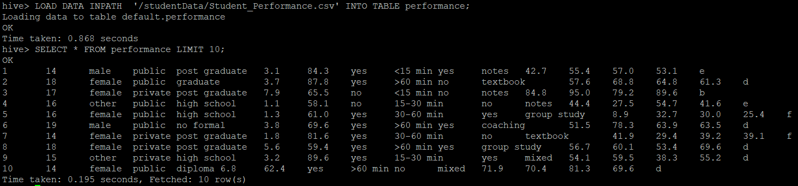
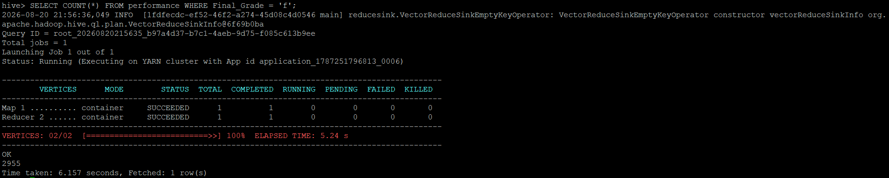

# Apache Hive — Managed Table & SQL Validation

## Role in the Pipeline

Apache Hive provides the structured SQL layer between HDFS storage and the Spark MLlib workload. The project data loaded through NiFi into HDFS is used to create and populate a Hive managed table.

## Hive Table Design

**Table name:** `home_temps`

I created the home_temps table to store the data from the original csv. This table has 9 columns, one to store a timestamp, the outdoor temperature and humidity at that time, and indoor temperature and humidity at 3 locations around the house. 

## SQL Files

- [`create_tables.sql`](create_tables.sql) — table creation and data-loading SQL
- [`queries.sql`](queries.sql) — validation, exploration, and aggregation queries

## Data Load Verification

I viewed the first 15 rows of the Hive table in order to confirm that the data loaded properly into the table.

## Query & Aggregation Verification

I used an aggregation COUNT query to count the number of rows of the table where the outdoor temperature was over 90%.
Because Hive was able to identify those rows, it also confirms that the schema was set up correctly.

The validated Hive table becomes the structured input used by the PySpark MLlib application.
