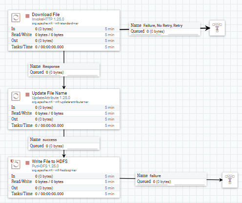
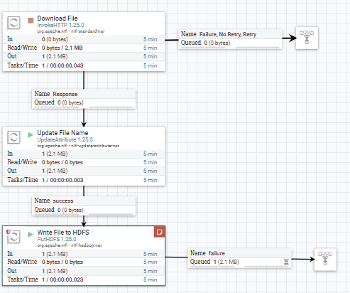
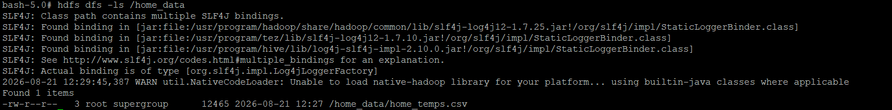

# Apache NiFi — Data Ingestion into HDFS

## Role in the Pipeline

Apache NiFi provides the ingestion and orchestration layer for this project. The completed flow retrieves the project dataset and writes it into HDFS for downstream processing.

## Source Dataset

**Dataset:** Student_Performance.csv  
**GitHub direct URL:** https://raw.githubusercontent.com/zkatz100/DSC_650_Katz/refs/heads/main/Student_Performance.csv
Originally sourced from Kaggle, this dataset contains some student demographic data along with data about study habits and scores in math, English, and science classes.

## Flow Design

Describe the important processors used in the final NiFi flow and the role each processor performs.

| Processor / Process Group | Role in the Flow |
|---|---|
| Download File | Accesses the Github link and downloads the csv file. |
| Update File Name | Renames the downloaded file with the chosen file name. |
| Write File to HDFS | Saves the downloaded file into the chosen directory in the HDFS cluster. |

## HDFS Destination

**HDFS path:** `[Enter final HDFS path]`

Explain where NiFi writes the dataset and how the destination is used by the next stage of the pipeline.

## Execution Evidence

### Final NiFi Flow

### Running Flow / Queue Activity

### HDFS Ingestion Verification

The HDFS screenshot should show the `hdfs dfs -ls` output confirming that the project dataset was successfully written into HDFS.
