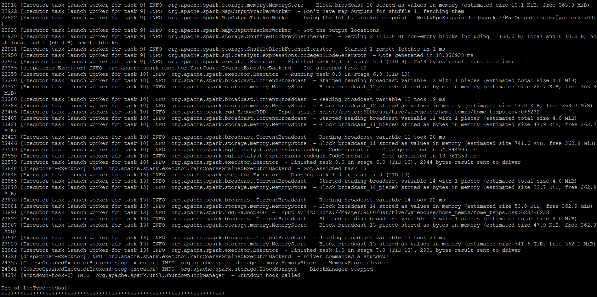
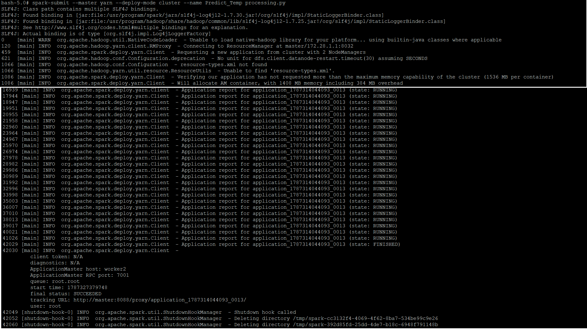

# Apache Spark MLlib — Distributed Machine Learning

## Role in the Pipeline

Apache Spark MLlib provides the distributed processing and machine learning layer for this project. The PySpark application reads project data from Hive, prepares the data for modeling, trains and evaluates a machine learning model, and generates model-performance metrics that are written into HBase.

## Hive Input

**Hive table:** `home_temps`

Spark will read the table of indoor and outdoor temperatures. To train the model, Spark will use the indoor temperatures and humidity in the three rooms to try to predict the outdoor humidity.

## Data Preparation & Transformations

For this project, I am looking for a relationship between indoor temperature and humidity with outdoor temperature.
When selecting features, I already know that there is a relationship between time and outdoor temperature, as well as between outdoor temperature and humidity. I therefore excluded these two columns from the training data.

All of my data was numeric, so I did not need to worry about encoding it. However, temperature and humidity are recorded on different scales, so i applied a standard scaler to all of the training and test data before applying the model. I also told the model to ignore any missing values,

## MLlib Algorithm

**Algorithm:** `Linear regression`

I chose linear regression because I am looking for a relationship between numeric indoor temperature and humidity values and the numeric outdoor temperature value.
For my target variable, I used outdoor_temp.
My feature variables were dining_temp, dining_hum, bathroom_temp, bathroom_hum, bedroom_temp, and bathroom_hum.

## Training & Evaluation

To train the model, I first read the Hive table into a Spark Dataframe and defined which columns would be features and the target. I then split the data into an 80% training set and a 20% test set.
I defined a pipeline with three stages to train the model:
First, I assembled the 6 feature columns into a single vector.
Second, I applied a standard scaler to those feature vectors.
Third, I sent the features into the regresion model to train it.

I applied the same pipeline to transform the features of the test set in order to evaluate the model.

**Primary evaluation metric(s):** `RMSE and r squared`
My model produced an RMSE of 9.65, meaning the average distance between predicted and real temperature is about 10 degrees.
the r squared value is 0.44, meaning 44% percent of variability in the outdoor temperature can be explained by variation in indoor temperature and humidity.

Overall, these two metrics show that the model is not very good at predicting close to the true outdoor temperature.

### Training Output



### Model Evaluation


## Spark Submit / YARN Execution

Document the exact `spark-submit` command used to submit the PySpark application through YARN.

```bash
spark-submit \
--master yarn \
--deploy-mode cluster \
--name Predict_Temp \
processing.py
```

Briefly describe the successful execution and any important log or output information.



## HBase Output

List the model-performance metrics written by Spark into HBase and explain how the application connects the machine learning stage to the final persistence layer.

**PySpark source files:** [`processing.py`](processing.py)
